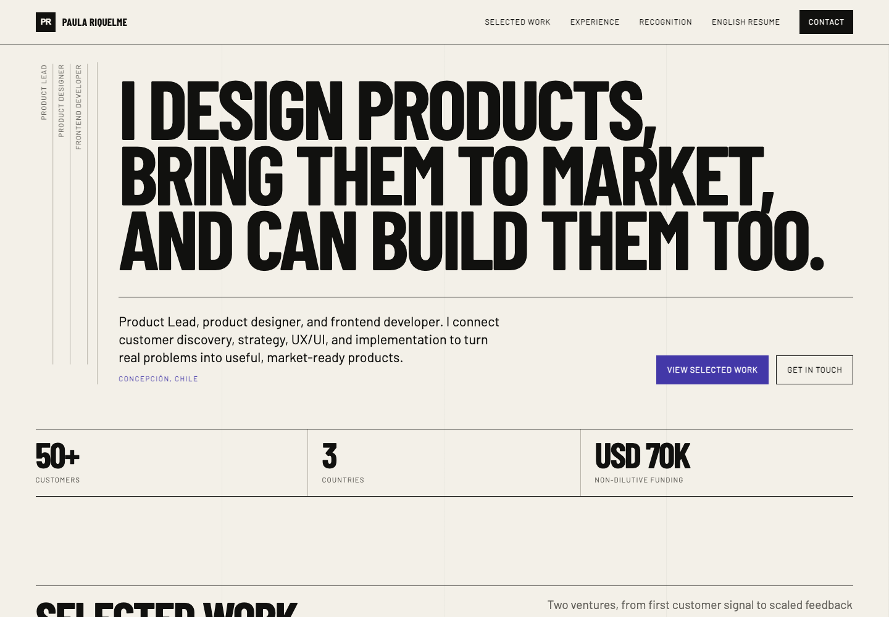
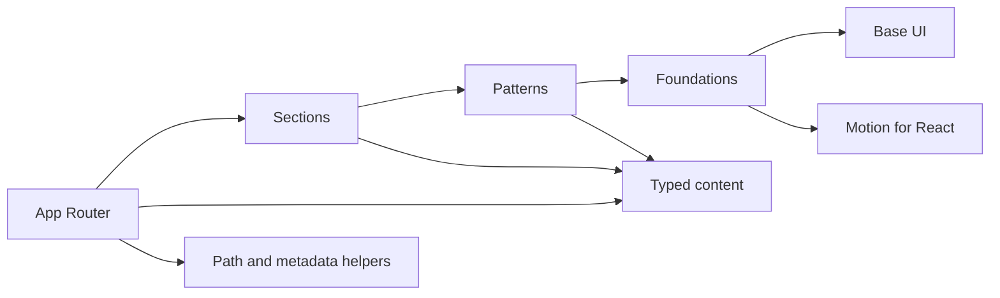

<div align="center">
  

  <h1>Paula Riquelme Portfolio</h1>

  <p><strong>Product leadership, product design, and frontend delivery in one evidence-led portfolio.</strong></p>

  <p>
    <a href="https://pauriquelmee.github.io/">View the live portfolio</a>
    ·
    <a href="https://github.com/PauRiquelmee/pauriquelmee.github.io">Browse the source repository</a>
  </p>

  <p>
    <a href="https://github.com/PauRiquelmee/pauriquelmee.github.io/actions/workflows/ci.yml">
      
    </a>
    <a href="https://github.com/PauRiquelmee/pauriquelmee.github.io/actions/workflows/pages.yml">
      
    </a>
  </p>
</div>

[](https://pauriquelmee.github.io/)

## Overview

This repository contains Paula Riquelme's English-only professional portfolio. It presents her work across customer discovery, product strategy, UX/UI, go-to-market execution, and frontend implementation through selected projects, measurable outcomes, professional experience, recognition, and press evidence.

The experience is designed as a product launch dossier, not a generic personal profile. Visitors can understand Paula's range quickly, inspect factual project evidence, download the English resume, and start a conversation from a fast, accessible static site.

## Product principles

- **Evidence before biography:** selected work and verified outcomes lead the story.
- **One source of truth:** portfolio facts live in [`src/content/portfolio.ts`](src/content/portfolio.ts) and are protected by tests.
- **Static by default:** meaningful content renders to HTML at build time, while JavaScript is reserved for navigation, motion, and project previews.
- **Honest previews:** projects use factual local screenshots and clear external links when third-party embedding is unavailable.
- **Accessible interaction:** semantic landmarks, keyboard navigation, focus restoration, reduced-motion support, visible focus states, and 44 px touch targets are part of the implementation contract.

## Architecture

Dependencies move in one direction so content, interaction, and presentation remain easy to reason about.



| Layer                        | Responsibility                                                            |
| ---------------------------- | ------------------------------------------------------------------------- |
| `src/app`                    | Route composition, global styles, metadata, sitemap, robots, and manifest |
| `src/components/sections`    | Page-level portfolio sections                                             |
| `src/components/patterns`    | Reusable compositions such as project cards and preview dialogs           |
| `src/components/foundations` | Base UI wrappers and low-level motion primitives                          |
| `src/content`                | Canonical typed portfolio and resume facts                                |
| `src/lib`                    | URL and static asset path helpers                                         |
| `tests/e2e`                  | Browser-level behavior across desktop and mobile                          |

Read the full [architecture record](docs/architecture.md) for dependency rules, rendering strategy, accessibility, SEO, assets, and deployment decisions.

## Technology

| Concern         | Choice                                                                   |
| --------------- | ------------------------------------------------------------------------ |
| Framework       | Next.js 16 App Router with React 19                                      |
| Language        | Strict TypeScript                                                        |
| Styling         | Tailwind CSS 4 and a documented custom design system                     |
| UI primitives   | Base UI from `@base-ui/react`                                            |
| Motion          | Motion for React with `LazyMotion` and user-controlled reduced motion    |
| Unit testing    | Vitest, React Testing Library, user-event, and jest-dom                  |
| Browser testing | Playwright on desktop Chromium and Pixel 7 viewports                     |
| Code quality    | ESLint, Prettier, architecture validation, and agent-document validation |
| Performance     | Lighthouse with enforced category targets                                |
| Hosting         | Static export deployed through GitHub Actions and GitHub Pages           |

## Run locally

### Prerequisites

- Node.js 22
- npm

### Setup

```bash
git clone https://github.com/PauRiquelmee/pauriquelmee.github.io.git
cd pauriquelmee.github.io
npm ci
npm run dev
```

Open [http://localhost:3000](http://localhost:3000) in your browser.

To test the same static output deployed to GitHub Pages:

```bash
npm run preview:pages
```

The production build is emitted to `out` and includes `.nojekyll`.

## Commands

| Command                         | Purpose                                                       |
| ------------------------------- | ------------------------------------------------------------- |
| `npm run dev`                   | Start the local Next.js development server                    |
| `npm run build`                 | Create the production static export                           |
| `npm run preview:pages`         | Build and serve the exported site locally                     |
| `npm run format`                | Format authored project files with Prettier                   |
| `npm run format:check`          | Verify formatting without changing files                      |
| `npm run lint`                  | Run ESLint, including the arrow-function convention           |
| `npm run typecheck`             | Run strict TypeScript checks without emitting files           |
| `npm run test`                  | Run the Vitest suite once                                     |
| `npm run coverage`              | Run unit tests with enforced coverage thresholds              |
| `npm run test:e2e`              | Test the static export in desktop and mobile Chromium         |
| `npm run screenshots`           | Capture desktop, tablet, mobile, menu, and preview evidence   |
| `npm run lighthouse`            | Audit performance, accessibility, best practices, and SEO     |
| `npm run validate:architecture` | Enforce component and dependency boundaries                   |
| `npm run validate:agent-docs`   | Confirm contributor instructions remain synchronized          |
| `npm run generate:assets`       | Regenerate optimized identity, media, icon, and resume assets |

## Quality bar

The repository treats quality requirements as executable constraints:

- Component coverage must remain at or above 90% for statements, lines, and functions, and 85% for branches.
- Lighthouse must reach at least 95 for performance, accessibility, and best practices, plus 100 for SEO.
- Every reusable component has one implementation, one colocated behavior test, and one default folder export.
- Every production TSX file contains one React component and at most one component-level JSX return.
- JavaScript and TypeScript use arrow functions, single-quoted strings, and double-quoted JSX attributes.
- The production route, metadata, assets, resume, navigation, dialogs, focus behavior, and reduced-motion path are covered by automated checks.

Run the complete pre-pull-request suite with:

```bash
npm run validate:architecture
npm run validate:agent-docs
npm run format:check
npm run test
npm run coverage
npm run lint
npm run typecheck
npm run build
npm run test:e2e
```

## Content and design integrity

- [`PRODUCT.md`](PRODUCT.md) defines the audience, purpose, positioning, constraints, and evidence on hand.
- [`DESIGN.md`](DESIGN.md) documents the product launch dossier direction, visual tokens, responsive rules, and component behavior.
- [`src/content/portfolio.ts`](src/content/portfolio.ts) is the canonical source for every visible professional claim.
- [`assets/source`](assets/source) contains supplied source imagery; [`public`](public) contains browser-ready assets and the English resume.
- [`public/llms.txt`](public/llms.txt) provides a concise machine-readable overview of the portfolio.

All visible copy, metadata, tests, documentation, workflow text, identifiers, and release communication are English only. Factual outcomes, dates, organizations, recognition, and links must remain traceable to the canonical product record.

## Deployment

Every push to `main` triggers continuous integration and the Pages workflow. Pages builds the static export, uploads `out` as an artifact, and deploys it through the official GitHub Pages actions with the `github-pages` environment, minimum permissions, and concurrency protection.

- [Live portfolio](https://pauriquelmee.github.io/)
- [Source repository](https://github.com/PauRiquelmee/pauriquelmee.github.io)
- [Continuous integration workflow](.github/workflows/ci.yml)
- [GitHub Pages workflow](.github/workflows/pages.yml)

## Contributing

This is a personal portfolio with a deliberately strict contribution contract. Work happens on `feature/*` or `hotfix/*` branches, follows test-driven development for behavior, preserves the architecture boundaries, and reaches `main` through a reviewed pull request.

Start with [`AGENTS.md`](AGENTS.md) before making changes.

## Usage

This repository is public for portfolio review and implementation transparency. It is not published as a reusable template, and no open-source license is currently provided.

## Maintainer

Built and maintained by [Paula Riquelme](https://www.linkedin.com/in/pauriquelme). For project or collaboration enquiries, use the contact section on the [live portfolio](https://pauriquelmee.github.io/#contact).
